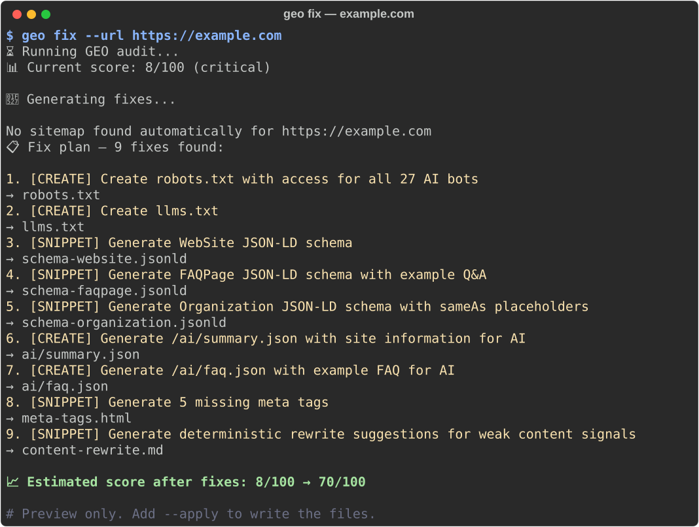
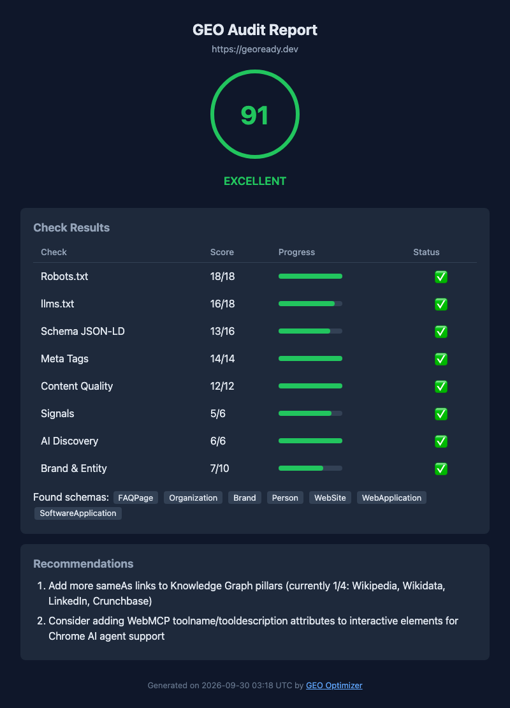

<div align="center">


# Your site ranks on Google. Does ChatGPT cite it?

### The open-source **Answer Engine Optimization (AEO)** & **Generative Engine Optimization (GEO)** toolkit.

One command scores any website 0–100 on whether **ChatGPT, Perplexity, Gemini, Claude, and Google AI Overviews** can crawl it, understand it, and cite it — then tells you exactly what to fix.

[](https://pypi.org/project/geo-optimizer-skill/)
[](https://pepy.tech/project/geo-optimizer-skill)
[](https://github.com/auriti-labs/geo-optimizer-skill/stargazers)
[](https://github.com/auriti-labs/geo-optimizer-skill/actions)
[](https://python.org)
[](LICENSE)

```bash
uvx --from geo-optimizer-skill geo audit --url https://yoursite.com
```


[Quick Start](#quick-start) · [Free web audit](https://geoready.dev) · [Docs](https://geoready.dev/docs/) · [The book](#the-book-behind-the-engine-ai-search-engineering) · [Changelog](CHANGELOG.md)

</div>

---

## What is GEO Optimizer?

**GEO Optimizer measures how visible a website is to AI answer engines** — ChatGPT, Perplexity, Google AI Overviews, Gemini, and Claude — scores it 0–100, and generates the fixes. It is free, MIT-licensed, and runs as a CLI, a Python library, an [MCP server](#mcp-server), a [GitHub Action](#cicd--fail-the-build-when-ai-readiness-drops), or an [Astro integration](#astro-integration).

The practice has several names — **Answer Engine Optimization (AEO)**, **Generative Engine Optimization (GEO)**, **AI SEO**, **LLM SEO** — and they describe the same problem: an answer engine gives one synthesized response and cites a handful of sources. Ranking on Google does not make you one of them. Being reachable, parseable, and quotable does.

**16 CLI commands** · **8 scoring categories** · **27 AI crawlers checked** · **47 content checks** · **12 MCP tools** · **8 output formats** · **2,000+ tests**

### What a real audit looks like

Two runs of `geo audit`, September 2026. `example.com` has no robots.txt, no `llms.txt`, and no structured data. `geoready.dev` is built with this engine's own [Astro integration](#astro-integration). Excerpts, condensed from the full text output.

<table>
<tr><th>example.com</th><th>geoready.dev</th></tr>
<tr><td>

```
[█░░░░░░░░░░░░░░░░░░░] 8/100
❌ CRITICAL — Site is not visible
   to AI search engines

📋 PRIORITY NEXT STEPS:
1. Create robots.txt with Allow rules
   for AI bots (GPTBot, ClaudeBot,
   PerplexityBot)
2. Create /llms.txt for AI indexing
3. Add WebSite JSON-LD schema
4. Add Organization JSON-LD schema
5. Add FAQPage schema with site FAQs
```

</td><td>

```
[██████████████████░░] 91/100
🏆 EXCELLENT

✅ 27/27 AI crawlers allowed
✅ llms.txt found (~3554 words)
✅ 7 schema types
✅ 0 prompt-injection patterns
✅ 1/4 Knowledge Graph pillars
⚠️  No dateModified signal
   (Wikipedia, Wikidata, LinkedIn,
   Crunchbase)
```

</td></tr>
</table>

Across 1,400+ sites audited through [GeoReady](https://geoready.dev/state-of-geo/), the median score is **57/100** and 58% publish an `llms.txt`. The sample is self-selected (people who chose to audit their site), so treat it as directional, not a census of the web.

### Then it writes the fixes

`geo fix` turns the audit into files: robots.txt rules for all 27 AI bots, `llms.txt`, JSON-LD schema, AI discovery endpoints, and meta tags. It previews by default and writes only with `--apply`. The score after fixes is the tool's own estimate, not a measured result.



---

## Quick Start

```bash
# Zero install
uvx --from geo-optimizer-skill geo audit --url https://yoursite.com

# Or install it
pip install -U geo-optimizer-skill

geo audit --url https://yoursite.com                   # score 0–100 + prioritized fixes
geo fix --url https://yoursite.com                     # preview robots.txt, llms.txt, schema, meta (--apply to write)
geo audit --url https://yoursite.com --threshold 70    # exit 1 below 70 — use it as a CI gate
geo citations --brand "Acme" --domain acme.com         # does AI cite you? (bring your own API key)
```

<details>
<summary><b>All 16 commands</b></summary>

```bash
# Audit a full sitemap and surface the weakest pages first
geo audit --sitemap https://yoursite.com/sitemap.xml --max-urls 25

# Compare before/after versions of a page
geo diff --before https://yoursite.com/page-old --after https://yoursite.com/page-new

# Save history, detect regressions, and show the trend
geo audit --url https://yoursite.com --save-history --regression
geo history --url https://yoursite.com

# What changed since the last snapshot? (CI: --fail-on warning)
geo drift --url https://yoursite.com

# Passive AI visibility snapshot for a domain
geo monitor --domain yoursite.com

# Ask real AI engines whether your brand is mentioned and your domain cited.
# AI answers vary run to run — sample each query 5x for a confidence interval.
geo citations --brand "YourBrand" --domain yoursite.com --topic "your product category" --runs 5

# Save or query archived AI answer snapshots, and score citation quality in one
geo snapshots --query "best GEO tool" --from 2026-03-01 --to 2026-03-30
geo snapshots --quality --snapshot-id 12 --target-domain yoursite.com

# Recurring monitoring with an HTML trend report
geo track --url https://yoursite.com --report --output ./geo-track-report.html

# Generate llms.txt from the sitemap, or check an existing one for stale URLs (exit 1)
geo llms --base-url https://yoursite.com --output ./public/llms.txt
geo llms --base-url https://yoursite.com --check-drift

# Generate or analyze JSON-LD schema
geo schema --type website --name "Your Site" --url https://yoursite.com
geo schema --file index.html --analyze

# Site-level and diagnostic tools
geo coherence --sitemap https://yoursite.com/sitemap.xml   # cross-page terminology consistency
geo authority --sitemap https://yoursite.com/sitemap.xml   # topical authority: clusters, pillars, depth
geo logs --file access.log                                  # AI crawler activity from server logs
geo access --url https://yoursite.com                       # browser vs AI-bot access simulation
geo perception --url https://yoursite.com                   # what an AI would extract from the page
```

Guides for most commands live in [`docs/`](docs/). Provider setup for `geo citations` (Perplexity, OpenAI, Anthropic, Groq, Gemini, MiniMax, DeepSeek, and SerpBase for the real Google SERP + AI Overview): [docs/llm-providers.md](docs/llm-providers.md).

</details>

---

## Is AI citing you? Ask it directly.

`geo citations` sends the questions your customers ask to real answer engines, then reports whether your brand is mentioned, whether your domain is cited as a source, and which competitors are cited instead.


Two honest caveats, both built into the tool:

- **Answers are not deterministic.** The same question can cite different sources on each run. `--runs 5` samples every query five times and reports a confidence interval instead of a single yes/no.
- **Not every API shows sources.** Perplexity Sonar returns the real source URLs. OpenAI, Anthropic, and Groq only reveal what the model already knows about your brand. Google AI Overviews is a SERP feature, not a model, so `--provider serpbase` observes the real Google results page instead.

---

## What it checks

| Area | Points | What GEO Optimizer looks for |
|------|--------|------------------------------|
| **Robots.txt** | /18 | 27 AI bots across 3 tiers (training, search, user). Citation bots explicitly allowed? |
| **llms.txt** | /18 | Present, has H1 + blockquote, sections, links, depth. Companion llms-full.txt? |
| **Schema JSON-LD** | /16 | WebSite, Organization, FAQPage, Article. Schema richness (5+ attributes)? |
| **Meta Tags** | /14 | Title, description, canonical, Open Graph complete? |
| **Content** | /12 | H1, statistics, external citations, heading hierarchy, lists/tables, front-loading? |
| **Brand & Entity** | /10 | Brand name coherence, Knowledge Graph links (Wikipedia/Wikidata/LinkedIn/Crunchbase), about page, topic authority |
| **Signals** | /6 | `<html lang>`, RSS/Atom feed, dateModified freshness? |
| **AI Discovery** | /6 | `.well-known/ai.txt`, `/ai/summary.json`, `/ai/faq.json`, `/ai/service.json`? |

**Score bands:** 86–100 Excellent · 68–85 Good · 36–67 Foundation · 0–35 Critical. Every weight is in [`models/config.py`](src/geo_optimizer/models/config.py) — read the rules and disagree with them. Full rubric: [SCORING_RUBRIC.md](SCORING_RUBRIC.md).

<details>
<summary><b>Beyond the score: 10 more checks</b></summary>

**Negative Signals** can deduct up to 5 points. The other checks are informational and do not change the score.

| Check | What it detects |
|-------|-----------------|
| **Negative Signals** | 8 anti-citation signals: CTA overload, popups, thin content, keyword stuffing, missing author, boilerplate ratio |
| **CDN Crawler Access** | Does Cloudflare/Akamai/Vercel block GPTBot, ClaudeBot, PerplexityBot? |
| **JS Rendering** | Is content accessible without JavaScript? SPA framework detection |
| **Prompt Injection Detection** | 8 manipulation patterns: hidden text, invisible Unicode, LLM instructions, HTML comment injection, monochrome text, micro-font, data-attr injection, aria-hidden abuse |
| **Trust Stack Score** | 5-layer trust aggregation (Technical, Identity, Social, Academic, Consistency) — grade A–F |
| **RAG Chunk Readiness** | Section word counts, definition openings, heading boundaries, anchor sentences |
| **Content Decay Prediction** | Temporal, statistical, version, event, and price decay patterns — evergreen score 0–100 |
| **Platform Citation Profile** | Per-platform readiness scores for ChatGPT, Perplexity, Google AI |
| **Multimodal Readiness** | Alt coverage, captions, VideoObject/AudioObject schema, subtitle tracks, transcripts |
| **WebMCP Readiness** | Chrome WebMCP support: `registerTool()`, `toolname` attributes, `potentialAction` schema |

Plus a separate **Citability Score** (0–100) built from 47 content checks, 9 of them taken directly from the methods tested in the [KDD 2024 GEO paper](https://arxiv.org/abs/2311.09735). Method list: [docs/geo-methods.md](docs/geo-methods.md).

</details>

**Topic authority** — answer engines map entities across a site, not single pages. `geo authority` clusters your pages by topic and scores depth, interlinking, and pillar pages:


---

## Show your GEO score

A live badge for your README — like a coverage badge, for AI visibility:


```markdown
[](https://geoready.dev?utm_source=badge)
```

Re-audited and cached hourly. No account needed. Colors: 86–100 green · 68–85 cyan · 36–67 yellow · 0–35 red.

---

## Integrations

### CI/CD — fail the build when AI-readiness drops

Treat AI visibility like test coverage. The GitHub Action scores your site, fails the build below a threshold, and uploads findings to the Security tab:

```yaml
# .github/workflows/geo.yml
- uses: Auriti-Labs/geo-optimizer-skill@v4.18.3
  with:
    url: https://yoursite.com
    min-score: 70        # fail the build below 70
    format: sarif        # findings in the GitHub Security tab
```

Any CI that runs Python works (GitLab, Jenkins, CircleCI). For longitudinal checks: `geo drift --url … --fail-on warning`. Output formats: `text`, `json`, `rich`, `html`, `pdf`, `sarif`, `junit`, `github`. The JSON format is the stable integration contract — see [docs/json-contract.md](docs/json-contract.md).

`--format html` writes a self-contained report you can hand to a client. This one is the real report for geoready.dev:



### MCP Server

Use GEO Optimizer from Claude, Cursor, Windsurf, or any MCP client:

```bash
pip install "geo-optimizer-skill[mcp]"
claude mcp add geo-optimizer -- geo-mcp
```

Then ask: *"audit my site and fix what's missing."*

<details>
<summary><b>12 MCP tools</b></summary>

| Tool | Purpose |
|------|---------|
| `geo_audit` | Full audit with score + recommendations |
| `geo_fix` | Generate fix files |
| `geo_llms_generate` | Generate llms.txt |
| `geo_citability` | Content citability analysis (47 checks) |
| `geo_schema_validate` | Validate JSON-LD |
| `geo_compare` | Compare multiple sites |
| `geo_gap_analysis` | Explain the gap between two sites and prioritize fixes |
| `geo_ai_discovery` | Check AI discovery endpoints |
| `geo_check_bots` | Check bot access via robots.txt |
| `geo_trust_score` | 5-layer trust signal aggregation |
| `geo_negative_signals` | 8 anti-citation signal detection |
| `geo_factual_accuracy` | Audit unsourced claims, contradictions, and broken citations |

</details>

### Python API

```python
from geo_optimizer import audit            # or audit_async

result = audit("https://example.com")
result.score                    # int, 0–100
result.band                     # "critical" | "foundation" | "good" | "excellent"
result.citability.total_score   # int, 0–100
result.score_breakdown          # {"robots": ..., "llms": ..., ...}
result.recommendations          # list of prioritized fixes
```

### Astro Integration

Generates `llms.txt`, `/.well-known/ai.txt`, and `/ai/summary.json` from your built routes at build time, and never overwrites hand-curated files. geoready.dev builds with it. Not yet published to npm — copy [`integrations/astro-geoready/`](integrations/astro-geoready/) to `integrations/astro-geoready/` in your project root:

```js
// astro.config.mjs
import geoReady from './integrations/astro-geoready/index.mjs';
export default defineConfig({
  site: 'https://yoursite.com',
  integrations: [geoReady({ siteName: 'Your Site' })],
});
```

### More

- **AI context files** — load GEO expertise into Claude Projects, ChatGPT, Cursor, Windsurf, or Kiro from [`ai-context/`](ai-context/).
- **Plugins** — add custom checks through the `geo_optimizer.checks` entry point. Example: [`examples/example_plugin.py`](examples/example_plugin.py).

---

## Research foundation

| Paper | Venue | What it found |
|-------|-------|---------------|
| [GEO: Generative Engine Optimization](https://arxiv.org/abs/2311.09735) | **KDD 2024** | 9 methods, evaluated on GEO-bench (10,000 queries). The best (citing sources, adding quotations, adding statistics) raised source visibility by up to 40%. Gains were largest for lower-ranked sources. |
| [AutoGEO](https://arxiv.org/abs/2510.11438) | **ICLR 2026** | Rules extracted automatically from engine preferences, up to +50.99% over the strongest KDD baseline. |
| [C-SEO Bench](https://arxiv.org/abs/2506.11097) | **NeurIPS D&B 2025** | Most content-rewriting tricks do not work. Ranking the source matters more than rewriting it. |

That finding is consistent with how the tool is weighted: GEO Optimizer puts most of its weight on whether crawlers can reach and parse a page (robots.txt, `llms.txt`, schema, meta) and treats content rewriting as the smaller lever. It measures readiness signals; it cannot guarantee that any engine will cite you, and it says so.

The full reasoning behind each signal and weight is written up in the book below.

---

## The book behind the engine: *AI Search Engineering*

**AI Search Engineering — A Technical Guide to Generative Engine Optimization (GEO), AI Citations, and Agent-Ready Websites**
Juan Camilo Auriti · 992 pages · English · 10 September 2026 · ISBN 979-8172934568

**The book explains the reasoning; this engine runs it.** The scoring weights, the eight signal categories, and the evidence classification described in print are the ones implemented in this repository. If you have ever wondered *why* robots.txt is worth 18 points and Signals only 6, the answer is in the book.

It treats GEO as an engineering discipline rather than a collection of tricks, organized around the path a page travels before it can be cited. Each stage maps to something you can run here:

| # | Stage in the book | Where the engine checks it |
|---|-------------------|----------------------------|
| 1 | Discovery | `llms.txt`, sitemap audit, AI discovery endpoints |
| 2 | Crawling | robots.txt (27 bots), CDN access, `geo access`, `geo logs` |
| 3 | Machine understanding | JSON-LD schema, JS rendering, entity signals, `geo perception` |
| 4 | Retrieval | RAG chunk readiness, `geo authority` |
| 5 | Answer generation | Citability score (47 checks) |
| 6 | Citation | `geo citations`, `geo snapshots`, `geo track` |
| 7 | Interaction | `/ai/*.json` endpoints, `.well-known/ai.txt` |
| 8 | Action | WebMCP readiness, prompt-injection detection |

What it covers:

- How answer engines discover and use web content, keeping **documented behaviour separate from research findings, observation, inference, and product-specific scoring**
- Auditing crawler access, robots controls, rendering, structured data, semantic HTML, and entity signals
- Engineering content for extraction and citation without arbitrary "AI-friendly" formulas
- Prompt research frameworks for measuring real AI visibility, and tracking citations over time
- Evaluating `llms.txt`, schema markup, and crawler directives **without overstating what they can do**
- Operational GEO workflows for teams, agencies, and technical SEO programmes
- Preparing sites for AI agents, plus prompt injection, content integrity, and agent security

**Appendices:** GEO audits, AI crawlers, JSON-LD templates, prompt research, citation tracking, evidence classification, CI/CD checks, client reporting, terminology, technical references.

**Written for** developers, technical SEOs, consultants, agencies, product teams, and site owners who want to know what can actually be measured, implemented, and defended in AI search. No guarantees, no invented ranking factors, no hype presented as fact — the same standard this engine holds itself to.

[**Paperback on Amazon**](https://www.amazon.it/dp/B0HJGLW5NP) · [**Kindle edition**](https://www.amazon.it/dp/B0H8K319JM) · [Book page](https://geoready.dev/book/)

Not ready to buy? Start with the free 160-page [**GEO Readiness Manual**](https://geoready.dev/geo-readiness-manual/).

---

## Open source vs hosted

| | GEO Optimizer (this repo) | [geoready.dev](https://geoready.dev) Free | GeoReady Pro / Studio / Agency |
|---|---|---|---|
| **Access** | MIT, runs locally | Web audit, no account | [Self-serve sign-up](https://app.geoready.dev/signup) |
| **Best for** | Developers, CI/CD, automation | Quick checks, SEO specialists | Ongoing clients, multi-site portfolios |
| **What you get** | Full engine, JSON output, all 16 commands | Single-URL score, [free tools](https://geoready.dev/tools/llms-txt-generator/) | Monitoring, score history, regression alerts, agency reporting |
| **Price** | Free forever | Free forever | From $19/month — [pricing](https://geoready.dev/pricing) |

Same engine everywhere. The platform adds what a local CLI cannot: server-side monitoring, history, and team features.

---

## Related tools

GEO Optimizer scores **input-side readiness** — the signals that make a site reachable, parseable, and citable. Outside the lightweight `geo citations` check, it does not observe what engines say about a brand, and it does not cover Chinese answer engines such as Doubao, Qwen, or Yuanbao (DeepSeek is available as a `geo citations` provider).

[**OpenGEO**](https://github.com/cangqiaoGEO) is a complementary open standard focused on **output-side observation**: whether engines actually mention or cite a brand, with a published interchange format. The split — readiness vs. results — is deliberate; see [#534](https://github.com/Auriti-Labs/geo-optimizer-skill/issues/534).

---

## FAQ

**What is Answer Engine Optimization (AEO)?**
AEO is the practice of structuring a website so AI answer engines — ChatGPT, Perplexity, Google AI Overviews, Gemini, Claude — can find, understand, and cite it as the direct answer to a user's question. It is also called Generative Engine Optimization (GEO), AI SEO, LLM SEO, or AI Search Optimization.

**How do I check if ChatGPT or Perplexity cites my website?**
Run `geo citations --brand "Your Brand" --domain yoursite.com` with a Perplexity or OpenAI API key. It asks the engine customer-style questions and reports whether your brand is mentioned, whether your domain is cited as a source, and which competitors are cited instead. Perplexity returns real source URLs; OpenAI and Anthropic reveal what the model knows about your brand. No account needed for the [free web version](https://geoready.dev/tools/ai-citation-checker/).

**Does GEO Optimizer guarantee that AI engines will cite my site?**
No. It measures the signals that make a site reachable, parseable, and quotable, and it tells you which ones are missing. Whether an engine cites you also depends on the question, the competition, and the engine itself — and answers change from run to run, which is why `geo citations` has `--runs`.

**Is this an llms.txt generator and checker?**
Yes. `geo llms` generates an `llms.txt` from your sitemap, `--check-drift` flags stale URLs, the audit scores its presence and depth, and the [Astro integration](#astro-integration) creates one at build time. There's also a [free online llms.txt generator](https://geoready.dev/tools/llms-txt-generator/).

**What is llms.txt, and does it improve AI citations?**
`llms.txt` is a Markdown file at the root of a site (`/llms.txt`) that gives language models a curated index of its most important pages. It is an organizational signal, not a proven ranking factor: no engine has documented that it improves citations. GEO Optimizer scores it because it is cheap to add and is intended to help AI systems read a site's structure.

**Is it free and open source?**
Yes — MIT licensed, free forever via `pip install geo-optimizer-skill` or `uvx`. The hosted [GeoReady](https://geoready.dev) platform runs the same engine and adds monitoring, score history, and team features.

**Which AI engines does it cover?**
27 AI crawlers, including ChatGPT (GPTBot, OAI-SearchBot), Perplexity (PerplexityBot), Claude (ClaudeBot, Claude-SearchBot), and Google (Googlebot, Google-Extended), plus per-platform readiness profiles for ChatGPT, Perplexity, and Google AI Overviews.

**How is it different from a traditional SEO tool?**
Traditional SEO tools optimize for Google rankings and backlinks. GEO Optimizer measures AI *citation readiness* — whether answer engines can crawl, parse, and quote your content — using signals (llms.txt, AI-bot access, schema richness, citability, topical authority) that classic SEO tools don't score. Standard technical SEO checks (meta tags, canonical URLs, Open Graph) are audited alongside them.

**What research is GEO Optimizer based on?**
Three peer-reviewed papers — *GEO: Generative Engine Optimization* (KDD 2024), *AutoGEO* (ICLR 2026), and *C-SEO Bench* (NeurIPS Datasets & Benchmarks 2025) — plus industry studies for the remaining content checks. Every check lists its source in [docs/geo-methods.md](docs/geo-methods.md).

**Is there a book on Generative Engine Optimization?**
Yes. *AI Search Engineering: A Technical Guide to Generative Engine Optimization (GEO), AI Citations, and Agent-Ready Websites* is a 992-page book by Juan Camilo Auriti, the author of GEO Optimizer, published 10 September 2026 (ISBN 979-8172934568). The scoring model it describes is the one implemented in this engine. See [the book](#the-book-behind-the-engine-ai-search-engineering).

---

## Roadmap

Focused release waves, not noisy patches: 85 releases since February 2026, currently **v4.18.3**. Next up is the v5.0 cycle — signal architecture, retrieval surface analysis, and scoring recalibration. Calendar and direction: [docs/ROADMAP.md](docs/ROADMAP.md).

---

## Contributing

```bash
git clone https://github.com/YOUR_USERNAME/geo-optimizer-skill.git
cd geo-optimizer-skill && pip install -e ".[dev]"
pytest tests/ -v   # 2,000+ tests, HTTP mocked
```

[Bug reports](https://github.com/Auriti-Labs/geo-optimizer-skill/issues/new?template=bug_report.yml) · [Feature requests](https://github.com/Auriti-Labs/geo-optimizer-skill/issues/new?template=feature_request.yml) · [CONTRIBUTING.md](CONTRIBUTING.md)

**Security:** every URL input is validated against private IP ranges (RFC 1918, loopback, link-local, cloud metadata) with DNS pinning before any request. Report vulnerabilities via [SECURITY.md](SECURITY.md).

---

## Star History

<a href="https://star-history.com/#Auriti-Labs/geo-optimizer-skill&type=Date">
  <picture>
    <source media="(prefers-color-scheme: dark)" srcset="https://api.star-history.com/svg?repos=Auriti-Labs/geo-optimizer-skill&type=Date&theme=dark" />
    <source media="(prefers-color-scheme: light)" srcset="https://api.star-history.com/svg?repos=Auriti-Labs/geo-optimizer-skill&type=Date" />
    
  </picture>
</a>

---

<div align="center">

GEO Optimizer is built and maintained by [Juan Camilo Auriti](https://www.linkedin.com/in/juancamiloauriti/) ([@JuanAuriti](https://x.com/JuanAuriti)) under [Auriti Labs](https://github.com/auriti-labs). If it saved you time, a ⭐ helps other people find it, and [GitHub Sponsors](https://github.com/sponsors/auriti) funds new research-backed checks.

[](https://github.com/auriti-labs/geo-optimizer-skill/stargazers)
[](https://github.com/sponsors/auriti)

**MIT License**

</div>
